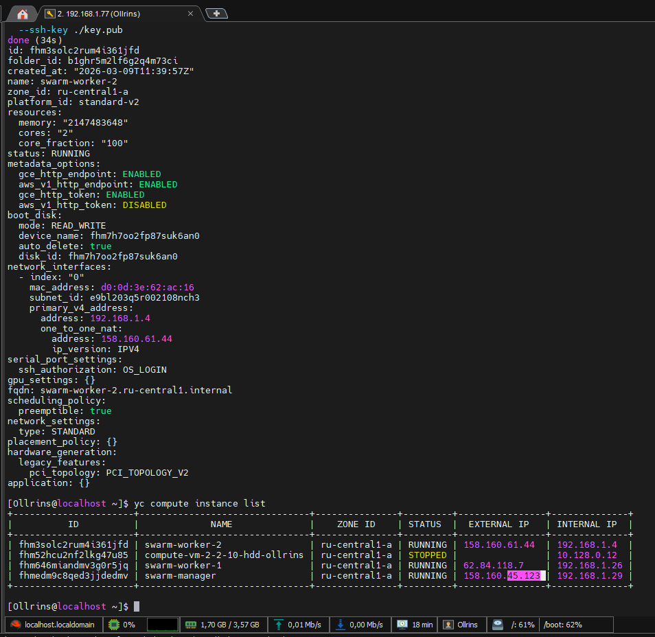
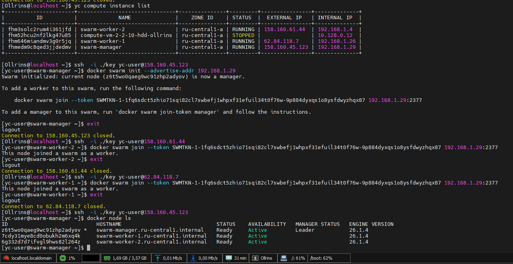
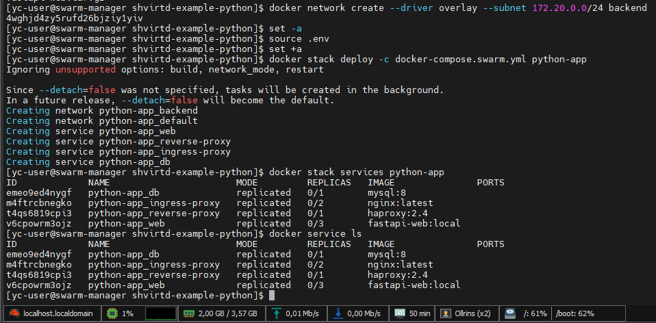

# Домашнее задание к занятию 6. «Оркестрация кластером Docker контейнеров на примере Docker Swarm»

## Задача 1 

   
  
  
  <em>Docker Swarm-кластер в Яндекс Облаке</em>

## Задача 2

  
   
  <em> python-fork из предыдущего ДЗ(05-virt-04-docker-in-practice) в Docker Swarm-кластер в Яндекс Облаке </em>

## Задача 1 
# Создание сети и подсети:

yc vpc network create --name swarm-network
yc vpc subnet create --name swarm-subnet --network-name swarm-network --range 192.168.1.0/24 --zone ru-central1-a

# Создание 3 прерываемых ВМ (2 ядра, 2GB RAM, 10GB диск):
# Manager
yc compute instance create \
  --name swarm-manager \
  --hostname swarm-manager \
  --zone ru-central1-a \
  --cores 2 \
  --memory 2 \
  --network-interface subnet-name=swarm-subnet,nat-ip-version=ipv4,security-group-id=$SECURITY_GROUP_ID \
  --create-boot-disk image-folder-id=standard-images,image-family=centos-7,size=10GB \
  --preemptible \
  --ssh-key ./key.pub

# Worker-1
yc compute instance create \
  --name swarm-worker-1 \
  --hostname swarm-worker-1 \
  --zone ru-central1-a \
  --cores 2 \
  --memory 2 \
  --network-interface subnet-name=swarm-subnet,nat-ip-version=ipv4,security-group-id=$SECURITY_GROUP_ID \
  --create-boot-disk image-folder-id=standard-images,image-family=centos-7,size=10GB \
  --preemptible \
  --ssh-key ./key.pub

# Worker-2
yc compute instance create \
  --name swarm-worker-2 \
  --hostname swarm-worker-2 \
  --zone ru-central1-a \
  --cores 2 \
  --memory 2 \
  --network-interface subnet-name=swarm-subnet,nat-ip-version=ipv4,security-group-id=$SECURITY_GROUP_ID \
  --create-boot-disk image-folder-id=standard-images,image-family=centos-7,size=10GB \
  --preemptible \
  --ssh-key ./key.pub

# Проверка созданных ВМ:
yc compute instance list

#  Создание Swarm кластера
На manager ноде:
# Получение внутреннего IP
ip addr show | grep 192.168

# Инициализация Swarm
docker swarm init --advertise-addr <ВНУТРЕННИЙ_IP>
Сохраннение команды для worker'ов
На worker-1 и worker-2:
Команда из вывода swarm init:
docker swarm join --token <TOKEN> <MANAGER_IP>:2377

# Проверка на manager:
docker node ls

## Задача 2
Клонирование репозитория:
git clone https://github.com/Ollrins/shvirtd-example-python.git
cd shvirtd-example-python

# Создание docker-compose.swarm.yml и конфигов прокси

#  Сборка и копирование образа

Сборка образа:

docker build -t fastapi-web:local -f Dockerfile.python .

Сохранение образа в архив:
docker save fastapi-web:local | gzip > fastapi-web.tar.gz

Копирование на worker-1 и worker-2):
scp -i ~/.ssh/key fastapi-web.tar.gz yc-user@<IP>:~/

На worker-1 и worker-2 загрузка образа:
ssh -i ./key yc-user@<IP>
docker load < fastapi-web.tar.gz

# Деплой в Swarm (на manager)

# Создание overlay сети:
docker network create --driver overlay --subnet 172.20.0.0/24 backend
# Загрузка переменных окружения:
set -a
source .env
set +a

# Деплой стека:
docker stack deploy -c docker-compose.swarm.yml python-app

# Проверка деплоя:
docker stack services python-app
docker stack ps python-app
docker service ls
docker service ps python-app_web

## Удаление стенда
Удаление стека:
docker stack rm python-app
docker network rm backend

Удаление ВМ:
yc compute instance delete swarm-manager
yc compute instance delete swarm-worker-1
yc compute instance delete swarm-worker-2

Удаление сети и группы безопасности:
yc vpc subnet delete swarm-subnet
yc vpc security-group delete swarm-security-group
yc vpc network delete swarm-network

